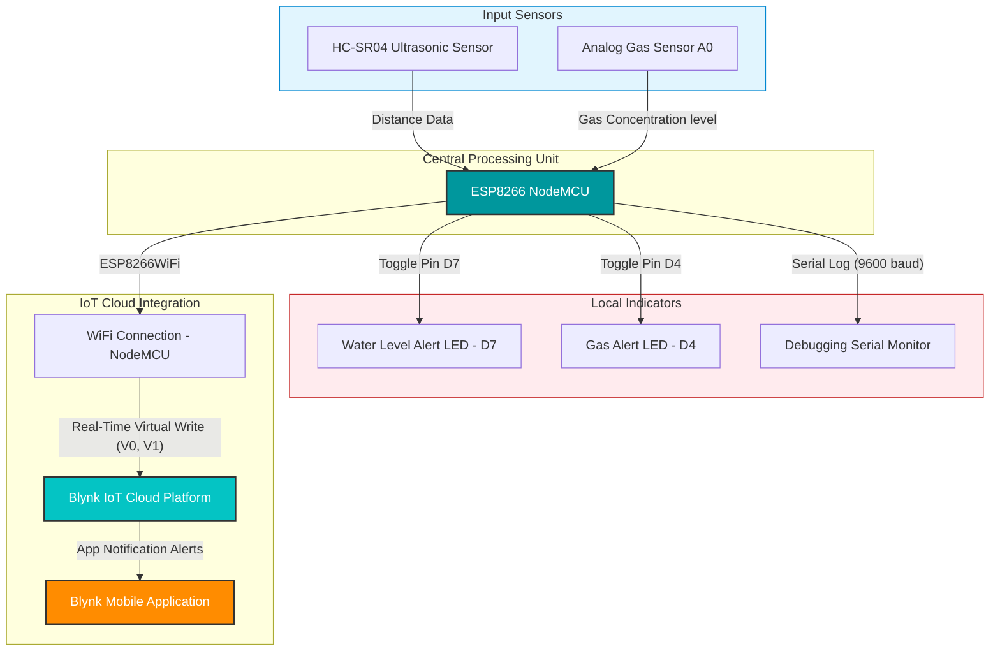

# Smart Sewer Monitoring System 🚨🌊

[](https://www.espressif.com/)
[](https://www.arduino.cc/)
[](https://blynk.io/)
[]()

An **Internet of Things (IoT) Smart Sewer and Safety Monitoring System** designed to prevent sewer accidents, minimize manual scavenging hazards, and protect the lives of sanitation workers. By continuously tracking water levels and detecting toxic/hazardous gases, this system provides real-time alerts both locally and to remote supervisors via the cloud.

---

## 📌 Table of Contents
1. [The Critical Problem](#-the-critical-problem)
2. [Proposed Solution & Key Features](#-proposed-solution--key-features)
3. [System Architecture](#-system-architecture)
4. [Hardware Components & Pinout Connections](#-hardware-components--pinout-connections)
5. [Software Configuration & Blynk IoT Setup](#-software-configuration--blynk-iot-setup)
6. [Project Repository Structure](#-project-repository-structure)
7. [Visuals & Screenshots](#-visuals--screenshots)
8. [License & Acknowledgements](#-license--acknowledgements)

---

## ⚠️ The Critical Problem

Every year, numerous sanitation workers lose their lives due to occupational hazards in underground sewer systems. Two primary factors contribute to these tragic events:
1. **Toxic Gas Accumulation**: Highly concentrated hazardous gases (such as Hydrogen Sulfide, Carbon Monoxide, and Methane) build up in confined sewer spaces, leading to asphyxiation or poisoning within seconds.
2. **Sudden Inundation**: Sudden increases in water levels due to industrial discharge, rain, or blockages trap workers inside.

Traditional methods rely on reactive measures. This project aims to introduce a **proactive, low-cost, smart prevention tool**.

*We have compiled research and media reports documenting this severe national issue in our folder:*
- [Delhi Case Study](Delhi%20death%20case.png)
- [Mumbai Case Study](Mumbai%20case.png)
- [Puducherry Case Study](Puducherry%20case.png)

---

## 🌟 Proposed Solution & Key Features

Our system utilizes an **ESP8266 NodeMCU** microchip combined with specialized sensors to continuously monitor the sewer environment:

* **🌊 Real-Time Water Level Monitoring**: Uses an ultrasonic distance sensor to calculate the sewer water level. If the level crosses the critical threshold (less than 8cm distance from the sensor), it triggers an immediate alarm.
* **☣️ Hazardous Gas Detection**: An analog gas sensor measures toxic gas concentration. If the concentration exceeds the safe threshold, it raises an instant toxic alert.
* **📱 Blynk IoT Cloud Integration**: Sends real-time telemetry (distance & gas concentration) to a cloud-based Blynk dashboard.
* **🚨 Dual Alert Mechanism**:
  - **Local**: High-intensity physical LEDs (Water Alert LED and Gas Alert LED) light up instantly to warn workers on-site.
  - **Remote / Cloud**: Instant push notification alerts (**"⚠️ Water level is high!"** & **"🚨 Gas level is HIGH!"**) are pushed to the Blynk mobile app for remote monitoring.

---

## ⚙️ System Architecture



---

## 🔌 Hardware Components & Pinout Connections

The physical circuit connects the NodeMCU with the sensors and LEDs as follows:

| Sensor / Component | Pin Name | ESP8266 NodeMCU Pin | Function |
| :--- | :--- | :--- | :--- |
| **Ultrasonic Sensor (HC-SR04)** | VCC | 3.3V / 5V | Power Supply |
| | GND | GND | Ground |
| | TRIG | **D5** | Triggering Ultrasonic Pulse |
| | ECHO | **D6** | Receiving Echo Signal |
| **Gas Sensor (e.g., MQ-2 / MQ-135)**| VCC | 5V / VIN | Power Supply |
| | GND | GND | Ground |
| | AO (Analog Output) | **A0** | Analog Voltage Reading (Gas level) |
| **Water Level LED (Physical Alert)** | Positive Terminal | **D7** | Visual alert when water level is high |
| **Gas Alert LED (Physical Alert)** | Positive Terminal | **D4** | Visual alert when toxic gas is detected |

---

## 💻 Software Configuration & Blynk IoT Setup

### 1. Library Dependencies
Ensure you have the following libraries installed in your Arduino IDE:
* **ESP8266WiFi** (Built-in)
* **Blynk** (by Volodymyr Shymanskyy)

### 2. Blynk IoT Template Configuration
Create a new template on the Blynk console with:
* **Template ID**: `TMPL3Q_IB40mj`
* **Template Name**: `Sewer monitor`
* **Datastreams**:
  - **V0**: Virtual Pin (Type: Double/Float) for **Distance / Water Level**
  - **V1**: Virtual Pin (Type: Integer) for **Gas Sensor Value**
* **Events**:
  - `alert`: Water level warning (**"⚠️ Water level is high!"**)
  - `gas_alert`: Gas level warning (**"🚨 Gas level is HIGH!"**)

### 3. Firmware Customization
Open `sewer_monitor.ino` and update your network credentials:
```cpp
// Input your WiFi Credentials here
char ssid[] = "YOUR_WIFI_SSID";
char pass[] = "YOUR_WIFI_PASSWORD";

// Input your Blynk Authentication token here
char auth[] = "YOUR_BLYNK_AUTH_TOKEN";
```

---

## 📁 Project Repository Structure

This repository is organized as follows:
* `sewer_monitor.ino`: The main Arduino project code containing firmware logic, WiFi config, threshold parameters, and Blynk communication.
* `updatedip.pptx`: The presentation deck detailing the research, block diagrams, and real-world implications.
* `Project Video.mp4`: A comprehensive video demonstration showing the live sensor telemetry and hardware setup.
* `Sewer-monitor-final/`: A sub-module folder containing alternate configuration codes and telemetry screenshots.

---

## 📸 Visuals & Screenshots

### 🛠️ Hardware Assembly & Prototype
Here is the hardware configuration and ESP8266 circuit prototype during live simulation:


---

### 📊 Blynk IoT Dashboard Telemetry
Screenshots of the Blynk app interface capturing real-time telemetry updates:

| Live Telemetry Logs | High Alert Events Triggered |
| :---: | :---: |
|  |  |

---

## 👥 The Team
This project was designed and engineered as a collaborative team project. 

* **GitHub Profile**: [@codejindal404-ux](https://github.com/codejindal404-ux)
* **Developers / Contributors**: Krish Jindal & Team.

---
*Disclaimer: This system is a prototype designed for academic and safety research purposes to illustrate the effectiveness of early-warning IoT integrations.*
